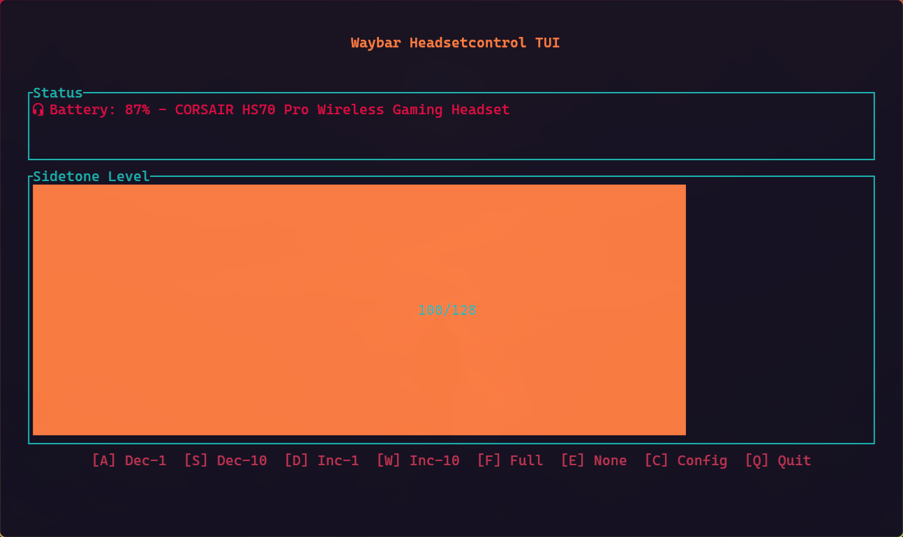

# [HeadsetControl](https://github.com/Sapd/HeadsetControl) integration for [Waybar](https://github.com/Alexays/Waybar)

A simple Rust and [ratatui](https://ratatui.rs/) based integration of HeadsetControl features into Waybar. Shows wireless headphone battery status with colored icons and provides an interactive TUI for sidetone control.



> Only works with headphones supported by HeadsetControl. See: [the official repo](https://github.com/Sapd/HeadsetControl/tree/master?tab=readme-ov-file#supported-devices)

## Features

- **Battery Display** - Shows battery percentage with color-coded icons (green >50%, yellow 15-50%, red <15%)
- **Sidetone Control** - Interactive TUI to adjust sidetone levels (0-128)
- **Configurable Keys** - Customize all keybindings and default sidetone via interactive config or terminal
- Automatically hidden from your waybar when no headphones are connected. Tui can still be launched from your terminal.

## Limitations

- Sadly, the currently set sidetone cannot be read from the headphones, so the TUI will always start with the default sidetone value (configurable in the settings). This is a limitation of the underlying HeadsetControl library, not this Waybar integration. Adjusting sidetone through the TUI or keybindings will work correctly, but the displayed value won't reflect external changes until you interact with it again.

## Installation

Make sure that you have a [Nerdfont](https://www.nerdfonts.com/) installed and configured in Waybar to see the icons.

### [AUR](https://aur.archlinux.org/packages/wb-headsetcontrol-git)

```bash
yay -S wb-headsetcontrol-git
# or
paru -S wb-headsetcontrol-git
```

After installation, the post_install hook will display instructions for Waybar configuration.

### Manual Build

1. Clone the repository:

```bash
git clone https://github.com/Henriklmao/waybar-headsetcontrol.git
cd waybar-headsetcontrol
```

2. Build with Cargo:

```bash
cargo build --release
```

3. Install the binary:

```bash
sudo install -Dm 755 target/release/wb-headset /usr/bin/wb-headset
```

## Configuration

### Waybar

You can modify the position in your waybar manually here `~/.config/waybar/config.jsonc`:

> The following can be automatically added to your waybar config by running `./install-waybar-config.sh`

```jsonc
{
  "modules-right": ["custom/headsetcontrol"], # You can use modules-left or modules-center instead if you prefer.

  "custom/headsetcontrol": {
      "exec": "/home/$USER/.local/bin/wb-headsetcontrol/wb-headset --waybar-status", #
      "return-type": "json",
      "interval": 10,
      "format": "{text}",
      "tooltip": true,
      "on-click": "kitty /home/$USER/.local/bin/wb-headsetcontrol/wb-headset", # You can set any terminal of your choice, however only kitty and alacritty are tested.
      "on-right-click": "bash -c '/home/$USER/.local/bin/wb-headsetcontrol/wb-headset --toggle-sidetone &'"
    },
}
```

### Keybindings & Settings

Configuration is automatically created at `~/.config/wb-headsetcontrol/config.toml`.

To configure interactively, either:

- Run: `wb-headset --config`
- Or press `c` inside the tui to interactively set your bindings.

Default keybindings:

- **a/s** - Decrease sidetone by 1/10
- **d/w** - Increase sidetone by 1/10
- **f** - Set sidetone to full (128)
- **e** - Set sidetone to none (0)
- **c** - Open configuration menu
- **q/ESC** - Quit

## Usage

Launch the interactive TUI:

> Same as left click on the waybar symbol, but you can also run it directly in the terminal.

```bash
wb-headset
```

Get battery status for Waybar:

> This prints the exact output thats routed into your waybar

```bash
wb-headset --waybar-status
```
